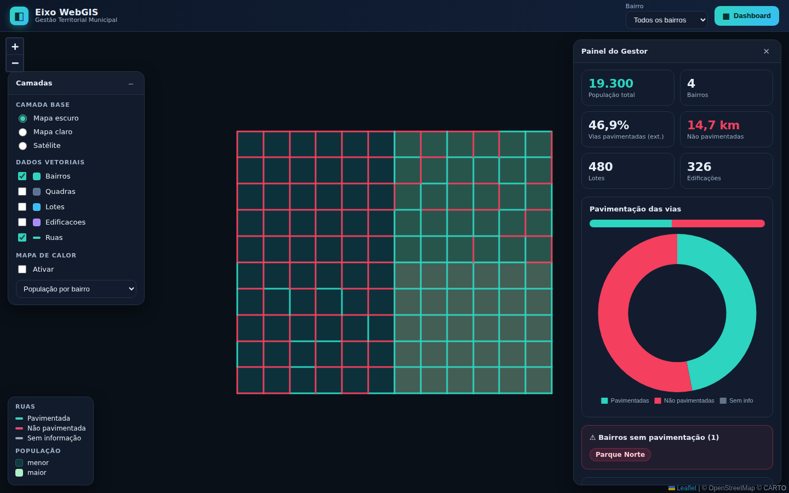

# BzR — Gestão Pública Municipal

Plataforma da **BzR Technology** (geoprocessamento + software) para gestão
pública municipal. Reúne, num único sistema, os dois módulos que antes
viviam em repositórios separados:

- **[Território](#módulo-território)** (`/`) — WebGIS de **lotes, quadras,
  ruas, edificações e bairros**, com mapa de calor, ortofoto e um dashboard
  de gestão territorial.
- **[Ordens de Serviço](#módulo-ordens-de-serviço)** (`/os`) — gestão de
  **O.S. da Secretaria de Infraestrutura** (abertura, acompanhamento,
  fotos, relatórios) com sincronização de **buracos reportados no Waze**.

Os dois módulos compartilham o mesmo servidor Node/Express, o mesmo banco
PostgreSQL/PostGIS e a mesma identidade visual da BzR.



> Acima, dados de demonstração do módulo Território. Vias pavimentadas em
> verde, não pavimentadas em vermelho; o painel da direita resume os
> indicadores.

## Stack

| Camada    | Tecnologia |
|-----------|------------|
| Front-end | HTML + CSS + JS (ES Modules), [Leaflet](https://leafletjs.com) (render em canvas), Leaflet.heat, [Chart.js](https://www.chartjs.org) — **sem build**, libs em `public/vendor/` |
| Back-end  | Node.js + Express |
| Banco     | PostgreSQL + **PostGIS** (Neon) via `pg` |
| Deploy    | Render (`render.yaml` / `Dockerfile`) |

> Usamos o driver `pg` (e não `@neondatabase/serverless`) porque no Render o
> serviço é um servidor persistente: o `pg` conecta no Neon por TCP+SSL, suporta
> transações e consultas espaciais, e roda igual num Postgres local.

## Estrutura

```
server.js               # Express: estáticos + API dos dois módulos + tiles da ortofoto
src/
  db.js                 # pool de conexão (pg), compartilhado pelos dois módulos
  schema.js             # schema do Território: extensão PostGIS, tabelas e índices
  queries.js            # GeoJSON das camadas, dashboard, mapa de calor, extent
  import.js             # núcleo do importador de GeoJSON (de-para de atributos, LGPD)
  os.js                 # API + schema do módulo de Ordens de Serviço e buracos do Waze
scripts/
  init-db.js            # cria o schema            (npm run init-db)
  seed-demo.js          # cidade de demonstração   (npm run seed)
  import-geojson.js     # importa seus GeoJSON     (npm run import)
  derive-bairros.js     # bairros a partir de quadras/lotes (npm run derive-bairros)
  reset-db.js           # limpa todas as tabelas   (npm run reset-db)
public/
  index.html, styles.css, js/, vendor/, assets/   # módulo Território (raiz do site)
  os/                                             # módulo Ordens de Serviço (/os)
data/                   # coloque aqui seus .geojson (ver data/README.md)
tiles/                  # tiles XYZ da ortofoto (ver tiles/README.md)
```

## Rodando localmente

Pré-requisitos: Node 18+ e um PostgreSQL com PostGIS (uma conta gratuita no
[Neon](https://neon.tech) já basta).

```bash
npm install
cp .env.example .env        # edite e cole a DATABASE_URL do Neon
npm run init-db             # cria extensão PostGIS, tabelas e índices (Território)
npm run seed                # (opcional) carrega a cidade de demonstração
npm start                   # http://localhost:3000  (Território)  e  /os  (Ordens de Serviço)
```

As tabelas do módulo de Ordens de Serviço (`ordens_servico`, `waze_buracos`)
são criadas automaticamente no boot, junto com o schema do Território.

## Módulo Território

WebGIS para análise territorial de municípios. Visualiza lotes, quadras,
ruas, edificações e bairros a partir de GeoJSON, com mapa de calor,
ortofoto e um dashboard de gestão que responde perguntas como:

- Quantas ruas (e quantos km) **não são pavimentadas**?
- Quais **bairros não possuem pavimentação**?
- Quais são os **bairros mais populosos** (e a densidade)?
- Como está distribuído o **uso do solo** dos lotes?

### Importando dados reais

**Pela plataforma (recomendado):** abra **`/importar`** (botão "Importar" no
topo do mapa), informe o município, arraste seus `.geojson`/`.json` e clique em
**Importar tudo**. A camada de cada arquivo é detectada pelo nome (ajustável),
os dados vão em lotes direto para o banco (nada precisa ser reimplantado) e as
áreas/extensões em metros são calculadas automaticamente. Em produção, proteja
a página definindo `IMPORT_TOKEN` (veja `.env.example`).

**Pela linha de comando:** copie os arquivos para `data/` e rode:

```bash
# 1a cidade (o --municipio marca os dados e habilita o seletor de cidade):
npm run import -- --dir data/ --municipio "Tabira" --truncate

# outra cidade depois (coloque os GeoJSON dela em data/ ou numa subpasta):
npm run import -- --dir data/outra-cidade/ --municipio "Outra Cidade" --truncate
```

Com `--municipio`, o `--truncate` substitui **apenas aquela cidade** (preserva as
demais). Sem `--municipio`, `--truncate` limpa a tabela inteira. Para um GeoJSON
de bairros derivado (quando o município não fornece), use `npm run derive-bairros`.
Para limpar tudo (`npm run reset-db`) ou só uma cidade (`npm run reset-db -- --municipio "Nome"`).

A camada é detectada pelo nome do arquivo (ou use `--layer`). O importador
mapeia as propriedades mais comuns (PT-BR/EN), **descarta campos pessoais
(LGPD) e vazios** e preserva o restante em `props`. As coordenadas devem estar
em **WGS84 (EPSG:4326)**. Quando o município não fornece um GeoJSON de bairros,
`derive-bairros` gera os polígonos a partir do campo `BAIRRO`. Detalhes em
[`data/README.md`](data/README.md).

### Ortofoto (tiles XYZ)

Coloque sua pasta de tiles em `tiles/ortho/{z}/{x}/{y}.png` — com
`SERVE_LOCAL_TILES=true` (padrão) ela é servida automaticamente e aparece como
camada **Ortofoto** no mapa. Para hospedar fora, aponte `ORTHO_TILE_URL`.
Detalhes em [`tiles/README.md`](tiles/README.md).

### API — Território

| Método | Rota | Descrição |
|--------|------|-----------|
| GET | `/api/health` | Status do banco e versão do PostGIS (sempre 200) |
| GET | `/api/config` | Configuração pública (mapa, ortofoto, camadas) |
| GET | `/api/counts` | Contagem de feições por camada |
| GET | `/api/bairros` | Lista de bairros (para filtros) |
| GET | `/api/extent` | Bounding-box de todos os dados |
| GET | `/api/dashboard` | Indicadores do painel do gestor |
| GET | `/api/heatmap?metric=` | Pontos do mapa de calor (`populacao`, `nao_pavimentadas`, `edificacoes`, `lotes`) |
| GET | `/api/layers/:layer` | Camada em GeoJSON (`bbox`, `bairro`, `limit`, `simplify`, `props`) |

Camadas válidas: `bairros`, `quadras`, `lotes`, `ruas`, `edificacoes`.

## Módulo Ordens de Serviço

Gestão de ordens de serviço da Secretaria de Infraestrutura: abertura com
fotos, acompanhamento por status (aberta → validada → andamento →
concluída/cancelada), histórico, importação em lote via CSV, exportação e
um dashboard de indicadores. Inclui também a sincronização de **buracos
reportados no Waze** (via BigQuery), exibidos num mapa próprio
(`/os/dashboard-waze.html`).

Interface **dark** e responsiva (celular e desktop), servida em `/os` (app
principal), com dois relatórios em janelas próprias: `/os/dashboard.html` e
`/os/dashboard-waze.html`.

### Dados de demonstração (apresentação ao cliente)

Para mostrar o módulo com dados fictícios antes dos reais, carregue 10 O.S. de
demonstração (João Pessoa, com coordenadas para aparecerem no mapa):

```bash
npm run seed-os              # recusa se já houver O.S. no banco
npm run seed-os -- --truncate # substitui o que existir por dados de demonstração
```

No deploy, sem shell, defina `SEED_OS_DEMO=true`: no boot, se **não houver
nenhuma O.S.**, o servidor carrega as ordens de demonstração automaticamente
(não apaga dados existentes). Volte para `false` ao operar com dados reais.

### Waze / BigQuery (opcional)

A sincronização com o Waze depende de uma tabela no BigQuery. Configure
`WAZE_BQ_PROJECT`, `WAZE_BQ_DATASET`, `WAZE_BQ_TABLE` e `WAZE_BQ_LOCATION`
(veja `.env.example`). Sem essas variáveis, o módulo de O.S. funciona
normalmente — apenas a sincronização com o Waze fica indisponível. O token
OAuth é informado na própria tela (`gcloud auth print-access-token`) e usado
só no momento da sincronização; os dados sincronizados ficam salvos no banco.

### API — Ordens de Serviço

| Método | Rota | Descrição |
|--------|------|-----------|
| GET | `/api/ping` | Testa a conexão com o banco |
| GET | `/api/diagnostico` | Esquema real da tabela `ordens_servico` (depuração) |
| GET | `/api/proximo-numero` | Próximo número sequencial de O.S. do ano |
| GET | `/api/ordens` | Lista todas as ordens de serviço |
| GET | `/api/ordens/:id` | Detalhe de uma ordem (com fotos) |
| POST | `/api/ordens` | Abre uma nova ordem de serviço |
| POST | `/api/ordens/importar` | Importa até 2000 ordens em lote (CSV processado no front) |
| PUT | `/api/ordens/:id` | Atualiza status, responsável, fotos, histórico etc. |
| DELETE | `/api/ordens/:id` | Remove uma ordem de serviço |
| POST | `/api/waze/token` | Sincroniza o BigQuery → banco com um token OAuth |
| GET | `/api/waze/config` | Configuração atual do BigQuery (sem expor o token) |
| GET | `/api/waze/buracos` | Buracos sincronizados (filtros: `dataInicio`, `dataFim`, `minRelatos`, `rua`) |

## Módulo Demandas

Gestão de tarefas internas da equipe (PD/CTM), em `/demandas`: prioridade,
status (**Pendente → Em andamento → Concluída/Cancelada**), múltiplos
responsáveis, prazo e vínculo opcional a município/lote. Quatro visões —
**Quadro (Kanban** com arrastar), **Lista**, **Minhas** e **Calendário** — mais
resumo e modal de criar/editar. Interface dark e responsiva.

Demonstração: `npm run seed-demandas` (ou `SEED_DEMANDAS_DEMO=true` no boot).

## Módulo Cadastro (BCI)

Coleta de campo do **Boletim de Cadastro Imobiliário**, em `/bci`, vinculada aos
**lotes** do Território. Formulário **dinâmico e versionável por município**
(padrão: o BCI oficial de Malta-PB, 9 seções / 68 campos), com **fotos**
(geral/croqui), **captura de GPS**, **fluxo de aprovação**
(Rascunho → Enviado → Aprovado/Rejeitado → Arquivado) e o sinal de **ajuste de
geometria** (o técnico marca que a divisa do lote precisa fundir/desmembrar/
redesenhar; o coordenador resolve). A lista traz um mapa dos pontos coletados
coloridos por status, e o popup de cada lote no Território tem um atalho
"Preencher BCI".

Demonstração: `npm run seed-bci` (ou `SEED_BCI_DEMO=true` no boot).

### Login e perfis (opcional)

Os módulos Demandas e BCI já preveem 3 perfis (**admin/coordenador/técnico**),
mas o login vem **desligado** por padrão (`AUTH_ENABLED=false`): tudo abre sem
autenticar e a tabela de usuários serve só como diretório de responsáveis.
Ligue `AUTH_ENABLED=true` para exigir login (tela `/login`) e aplicar os perfis
— útil para o fluxo real de aprovação do BCI. Defina também `AUTH_SECRET` e,
opcionalmente, `ADMIN_EMAIL`/`ADMIN_PASSWORD` (contas de demonstração são
criadas no primeiro boot).

### API — Demandas e BCI (principais)

| Método | Rota | Descrição |
|--------|------|-----------|
| GET/POST | `/api/demandas` | Lista (filtros) / cria demanda |
| PUT/DELETE | `/api/demandas/:id` | Atualiza / remove |
| PATCH | `/api/demandas/:id/status` | Transição de status (Kanban) |
| GET | `/api/bci/formulario?municipio=` | Definição do formulário (seções/campos) |
| GET/POST | `/api/bci` | Lista (filtros) / cria BCI |
| GET/PUT/DELETE | `/api/bci/:id` | Detalhe / atualiza / remove |
| PATCH | `/api/bci/:id/status` | Fluxo: `enviar`/`aprovar`/`rejeitar`/`arquivar`/`reabrir` |
| PATCH | `/api/bci/:id/ajuste` | Marca o ajuste de geometria como resolvido |
| POST/DELETE | `/api/bci/:id/fotos[/:fid]` | Anexa / remove fotos |
| GET | `/api/bci/mapa` | Pontos coletados (para o mapa) |

## Deploy no Render

1. Crie um banco no **Neon** e copie a connection string (com `?sslmode=require`).
2. No Render, crie o serviço a partir deste repositório (Blueprint usando o
   `render.yaml`, ou Docker usando o `Dockerfile`).
3. Defina `DATABASE_URL` (e, opcionalmente, `ORTHO_TILE_URL` e as variáveis
   `WAZE_BQ_*`). Para subir já com o demo do Território, use `SEED_DEMO=true`
   (carrega no primeiro boot se o banco estiver vazio).

O schema (Território + Ordens de Serviço) é criado automaticamente no boot.
Health check em `/api/health`.

## Licença

MIT — © BzR Technology
